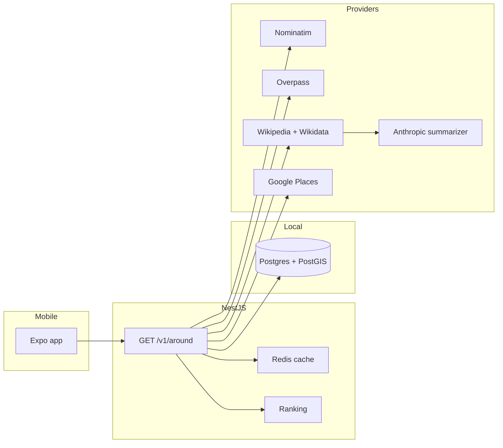

# Around

A mobile app for the "I'm somewhere new and curious" moment. Open it, allow location, and get one screen: what this place is, what's famous nearby, essentials, food, stays, and coffee.

This repository is a pnpm monorepo.

```
apps/mobile            Expo (React Native, TypeScript)
apps/api               NestJS
packages/shared-types  Response types shared by the API and the app
docker-compose.yml     Postgres/PostGIS 16 + Redis 7
```

## Architecture



The API talks to providers through `GeocodingProvider`, `PlacesProvider`, and `EncyclopediaProvider`. Each section loads on its own and returns `status: ok | empty | error | not_found`. Etymology is summarized only from retrieved Wikipedia/Wikidata text. If that text is missing, the response is `not_found` and the model is not called.

Step 1 (this commit) boots the monorepo, Compose, and `GET /health`. Provider calls land in the next steps.

## Prerequisites

- Node.js 22+
- pnpm 10 (`corepack enable && corepack prepare pnpm@10.17.1 --activate`)
- Docker, for Postgres and Redis

## Setup

```bash
cp .env.example .env
pnpm install
docker compose up -d
pnpm dev:api
```

Compose publishes Postgres on host port **5433** so it can run next to a Postgres that already owns 5432. Redis stays on 6379.

In another terminal:

```bash
pnpm dev:mobile
```

## Verify

API health (dependencies up after Compose is healthy):

```bash
curl -s http://localhost:3000/health
```

```json
{
  "status": "ok",
  "service": "around-api",
  "checks": {
    "postgres": { "status": "up", "latency_ms": 12 },
    "redis": { "status": "up", "latency_ms": 2 }
  }
}
```

Before Docker is running, the same endpoint returns `"status": "degraded"` and `"status": "down"` on each check. The process itself is still up.

Swagger UI: [http://localhost:3000/docs](http://localhost:3000/docs)

Tests and lint:

```bash
pnpm test
pnpm lint
```

The mobile shell shows the app name from `@around/shared-types` and the health line from `EXPO_PUBLIC_API_URL` (default `http://localhost:3000`). On a physical device, set that to your computer's LAN address. The Android emulator uses `http://10.0.2.2:3000`.

## Environment

Every key is documented in [`.env.example`](.env.example). `GOOGLE_PLACES_API_KEY` and `ANTHROPIC_API_KEY` can stay empty until those steps.
