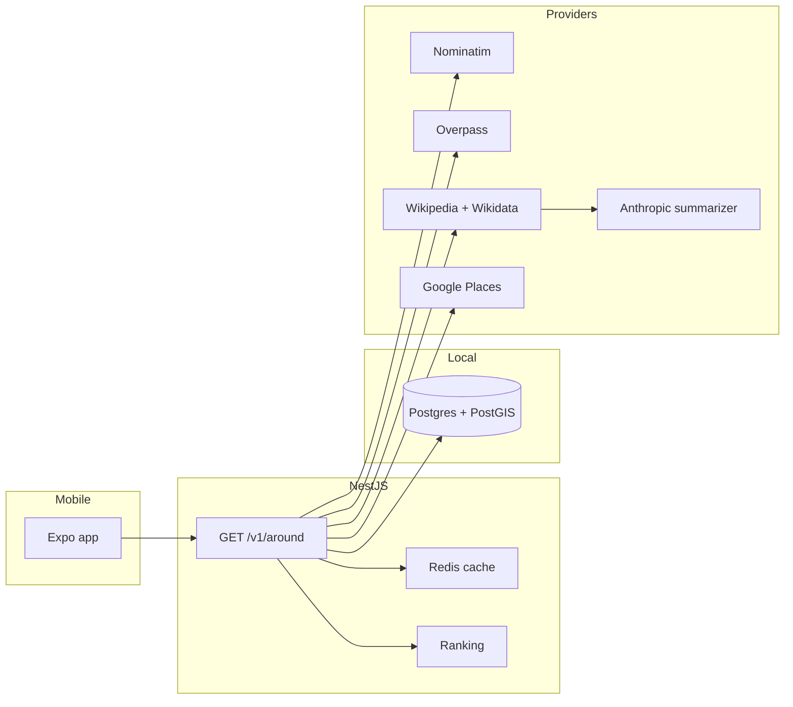

# Around

A mobile app for the "I'm somewhere new and curious" moment. Open it, allow location, and get one screen: what this place is, what's famous nearby, essentials, food, stays, and coffee.

This repository is a pnpm monorepo.

```
apps/mobile            Expo (React Native, TypeScript)
apps/api               NestJS
packages/shared-types  Response types shared by the API and the app
docker-compose.yml     Postgres/PostGIS 16 + Redis 7
```

## Architecture



The API talks to providers through `GeocodingProvider`, `PlacesProvider`, and `EncyclopediaProvider`. Each section loads on its own and returns `status: ok | empty | error | not_found`. Etymology is summarized only from retrieved Wikipedia/Wikidata text. If that text is missing, the response is `not_found` and the model is not called.

`GET /v1/around` loads each section on its own. Nominatim supplies the place hierarchy. Overpass supplies famous places and the nearest hospital, police station, and pharmacy, including ones past the selected radius. Eat, stay, and coffee stay `error` until a places key is configured. Redis caches successful sections. Postgres stores the geocoded place when it is reachable.

## Prerequisites

- Node.js 22+
- pnpm 10 (`corepack enable && corepack prepare pnpm@10.17.1 --activate`)
- Docker, for Postgres and Redis

## Setup

```bash
cp .env.example .env
pnpm install
docker compose up -d
pnpm dev:api
```

Compose publishes Postgres on host port **5433** so it can run next to a Postgres that already owns 5432. Redis stays on 6379.

In another terminal:

```bash
pnpm dev:mobile
```

## Verify

API health (dependencies up after Compose is healthy):

```bash
curl -s http://localhost:3000/health
```

```json
{
  "status": "ok",
  "service": "around-api",
  "checks": {
    "postgres": { "status": "up", "latency_ms": 12 },
    "redis": { "status": "up", "latency_ms": 2 }
  }
}
```

Before Docker is running, the same endpoint returns `"status": "degraded"` and `"status": "down"` on each check. The process itself is still up.

Swagger UI: [http://localhost:3000/docs](http://localhost:3000/docs)

Tests and lint:

```bash
pnpm test
pnpm lint
```

The mobile app asks for location after a short explainer. If location is denied, blocked, or switched off, search a place instead. The radius chips (5 / 10 / 25 / custom) refetch each section on its own. Settings has kilometres or miles, and a placeholder for which sections open by default.

`EXPO_PUBLIC_API_URL` defaults to `http://localhost:3000`. On a physical device, set that to your computer's LAN address. The Android emulator uses `http://10.0.2.2:3000`.

Around, using Bengaluru as an example. Set `NOMINATIM_USER_AGENT` in `.env` to a real contact address before calling the public Nominatim service.

```bash
curl -s "http://localhost:3000/v1/around?lat=12.9716&lng=77.5946&radius_km=10"
curl -s "http://localhost:3000/v1/around/essentials?lat=12.9716&lng=77.5946&radius_km=10"
curl -s "http://localhost:3000/v1/places/search?q=Mysuru"
```

Essentials still appear when the nearest hospital is farther than `radius_km`, with `distance_m` set. Famous places return `Nothing within X km` when both the requested radius and one expansion are empty. A second identical request should be fast once Redis is up, because the section was cached.

## Environment

Every key is documented in [`.env.example`](.env.example). `GOOGLE_PLACES_API_KEY` and `ANTHROPIC_API_KEY` can stay empty until those steps.
